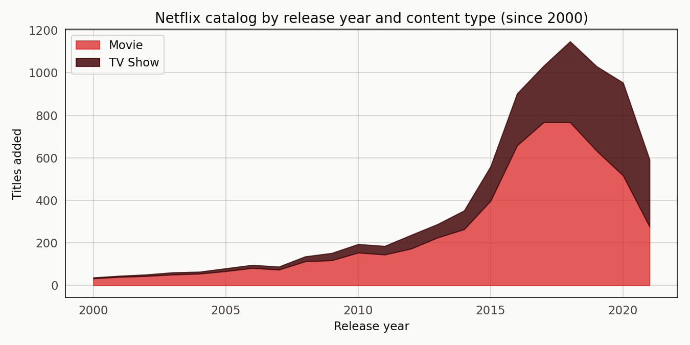
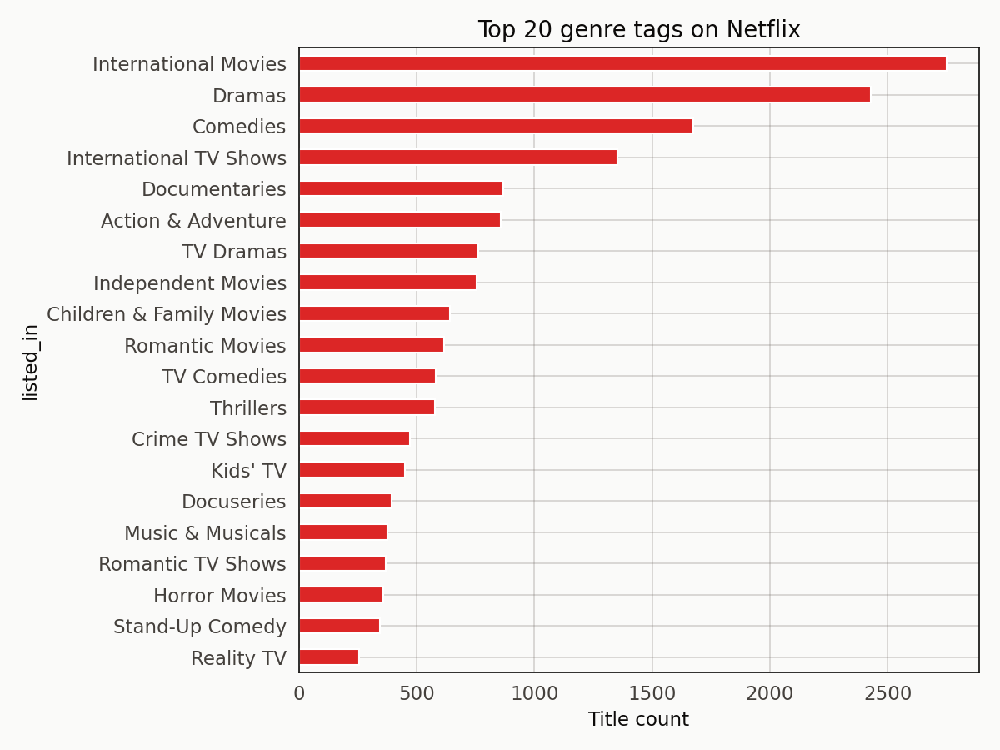
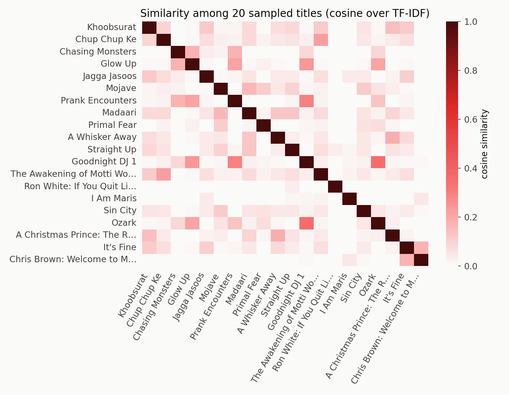
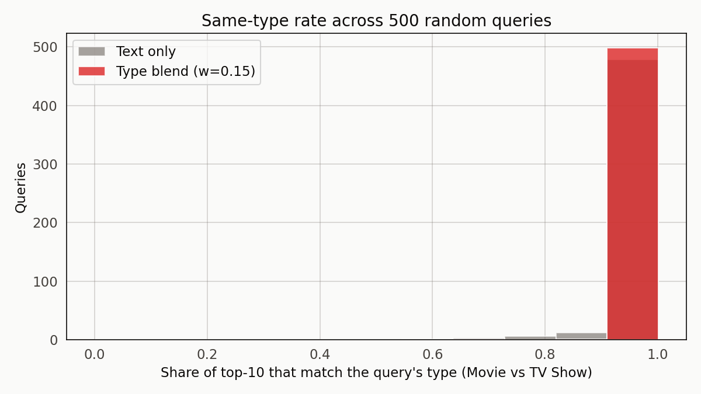
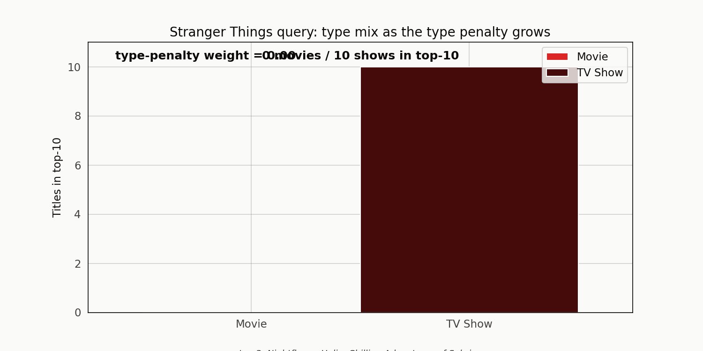

# When the Description Field Does the Work: A Netflix Content Recommender

A TF-IDF recommender over 8,807 Netflix titles — built on the one-sentence description field plus the genre tags — produces top-10 lists that read like something an actual curator would suggest. Query with Stranger Things and you get Nightflyers, Helix, and Chilling Adventures of Sabrina in the top five. Query with Squid Game and you get Kakegurui and Til Death Do Us Part — other Korean and international thrillers. Query with Black Mirror and you get a cluster of British TV dramas.

The last one is the interesting failure mode. The signal in Black Mirror's description is dominated by the "British TV Shows" and "International TV Shows" tags, so the neighborhood fills with British dramas that aren't Black Mirror at all. The model captures something real — the British-show label does describe Black Mirror — but it prioritises the wrong similarity dimension.

## The dataset

8,807 rows from Shivam Bansal's Netflix titles CSV on Kaggle. Each row carries title, type (Movie / TV Show), director, cast, country, release year, rating, duration, genre tags (`listed_in`), and a one-sentence description. I filled the blanks in the categorical columns and left the description text as-is.

6,131 rows are movies. 2,676 are TV shows. Both grow steadily through the 2000s and 2010s, with a visible step-up around 2016 when Netflix's original-content slate scaled.

The top genre tags include International Movies (2,752), Dramas (2,427), Comedies (1,674), International TV Shows (1,351), Documentaries (869), and a long tail. Some tags function like demographic markers (Kids' TV, Children & Family Movies); others like content descriptors (Crime TV Shows, Horror Movies).

## The recommender

TF-IDF over a concatenation of the description text and the genre tag list, with genre tags repeated once for a mild weight boost. `TfidfVectorizer` from scikit-learn, English stopwords, 1-2 n-grams, minimum document frequency of 3, capped at 20,000 features. L2-normalised so the dot product is the cosine similarity.

Given a query row, the recommender takes the dot product of that row against every other row and returns the top-k. The top-10 same-type rate (Movie vs. TV Show) over 500 random queries is 99.3 percent before any type penalty is added. A small type penalty (weight 0.15) pushes that to 99.9 percent, but the gain is in the noise — the recommender already respects the type boundary because Movie descriptions and Show descriptions read differently.

The similarity heatmap over 20 random titles shows the expected structure. Diagonal is 1.0 by construction. The off-diagonal is mostly near-zero with a few bright spots where two titles share description vocabulary or genre tags. That sparsity is exactly what you want in a content recommender — most titles are unrelated, and the ones that are related should stand out clearly.

## Where it works and where it tugs

The type-retention plot is the anti-climax of the project. Unlike the Spotify audio-similarity case, where the naive recommender leaked wildly across genres, Netflix's description text carries enough Movie-vs-Show signal that the recommender respects the type boundary almost automatically.

The interesting failure mode is genre-tag shadowing. When a title's tag list includes a dominant tag like "British TV Shows" or "International TV Shows", the recommender tends to cluster on the dominant tag rather than the content of the description. Black Mirror gets pulled toward British dramas; Squid Game toward Korean thrillers. Both are defensible neighborhoods, but they miss the specific content vibe — the sci-fi-horror of Black Mirror, the survival-game tension of Squid Game.

## A Stranger Things animation

The type-weight animation steps through the Stranger Things query at sixteen different type penalties from 0 to 0.3. You can see the movie count drop to zero almost immediately (the query is a TV Show, so a small penalty pushes any movie candidate out of the top-10) and the top-3 neighborhood churn as weight grows. The neighbors don't change much in the middle range — once you've penalised movies out, the remaining candidates are already TV Shows with similar tags.

The animation is useful less for demonstrating a problem to solve than for showing how sensitive the ranking is to small penalty weights. It's a workable knob for a curator who wants to nudge the neighborhood.

## What would make this better

A natural next step is a TF-IDF + BM25 comparison — BM25 handles the long-tail of common genre tags more gracefully. A multi-tag embedding approach (one embedding per tag, concatenated) would mitigate the genre-tag shadowing problem by separating content similarity from tag membership. And a behavioral layer — co-watch patterns or rating correlations — is what a real Netflix recommender would actually run.

For a 30-line text recommender, what's here is already doing work. That's the honest takeaway.

## References

Bansal, S. (n.d.). *Netflix movies and TV shows* [Data set]. Kaggle. https://www.kaggle.com/datasets/shivamb/netflix-shows

Jones, K. S. (1972). A statistical interpretation of term specificity and its application in retrieval. *Journal of Documentation*, 28(1), 11-21.

Aggarwal, C. C. (2016). *Recommender Systems: The Textbook*. Springer.
